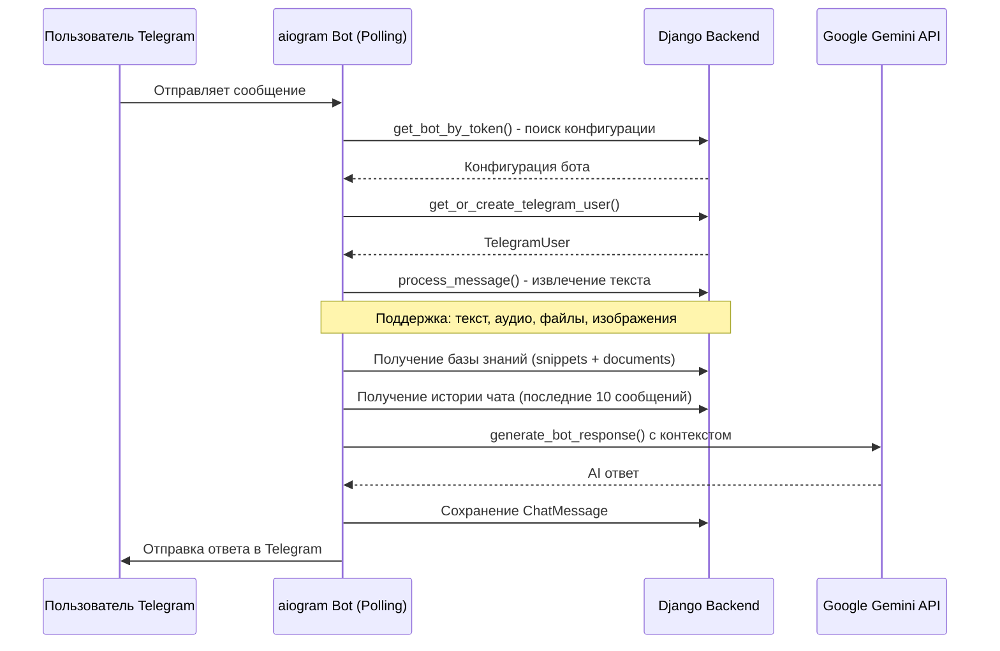

# Bot Factory - Платформа для создания AI-ботов

## 📋 Описание проекта

**Bot Factory** - это SaaS-платформа для создания и управления AI-ботами с интеграцией Telegram и Google Gemini. Платформа позволяет пользователям создавать неограниченное количество умных ботов без написания кода, настраивая их через веб-интерфейс.

### Ключевые возможности

- ✨ **Создание AI-ботов без кода** - интуитивный веб-интерфейс для настройки ботов
- 🤖 **Интеграция с Telegram** - автоматическое развертывание ботов в Telegram
- 🧠 **Google Gemini AI** - использование современных языковых моделей для генерации ответов
- 📚 **База знаний** - загрузка документов и текстовых фрагментов для обучения ботов
- 💬 **Управление диалогами** - отслеживание и анализ всех разговоров
- 📊 **Аналитика** - подробная статистика использования и активности
- 🔐 **Безопасность** - шифрование токенов, JWT аутентификация, защита API
- 🚀 **Мультибот система** - одновременное управление несколькими ботами
- 🔄 **Автоматическая синхронизация** - динамическая перезагрузка при изменении конфигурации

---

## 🏗️ Архитектура проекта

### Компоненты системы

```
bot-factory/
├── backend/          # Django REST Framework API (Python 3.11+)
│   ├── apps/         # Приложения Django
│   ├── services/     # Внешние сервисы (Gemini API)
│   ├── core/         # Утилиты и middleware
│   └── bot_factory/  # Настройки проекта
├── bot/              # Telegram Bot Service (aiogram 3.x)
│   ├── handlers/     # Обработчики команд и сообщений
│   ├── services/     # Бизнес-логика ботов
│   ├── integrations/ # Интеграция с Django ORM
│   └── main.py       # Точка входа
├── frontend/         # Admin Panel (React + TypeScript + Vite)
│   ├── pages/        # Страницы приложения
│   ├── components/   # React компоненты
│   ├── store/        # Zustand state management
│   └── services/     # API клиент
└── docker-compose.yml  # PostgreSQL + Redis
```

### Технологический стек

| Компонент | Технология | Версия | Назначение |
|-----------|------------|--------|------------|
| **Backend** | Django | 5.0 | REST API, админка, модели данных |
| | Django REST Framework | 3.14+ | RESTful API endpoints |
| | PostgreSQL | 15 | Основная база данных |
| | pgvector | - | Векторные эмбеддинги для RAG |
| | Redis | - | Кеширование, rate limiting |
| | Celery | - | Асинхронные задачи |
| **Bot** | aiogram | 3.x | Multi-bot Telegram polling |
| | Google Gemini API | - | AI генерация ответов |
| **Frontend** | React | 19 | Админ-панель |
| | TypeScript | 5.x | Типизация |
| | Vite | - | Сборщик и dev-сервер |
| | Zustand | - | State management |
| | TailwindCSS | - | Стилизация |
| **Deployment** | Docker | - | Контейнеризация |
| | Nginx | - | Reverse proxy, статика |
| | Gunicorn | - | WSGI сервер |

---

## 📊 Модели данных

### Основные модели

#### User (apps/accounts)
Модель пользователя платформы с поддержкой JWT авторизации.

```python
- id: UUID (PK)
- email: EmailField (unique, используется для входа)
- name: CharField (полное имя)
- password: CharField (хешированный)
- plan: CharField (Free/Pro/Enterprise)
- telegram_id: BigIntegerField (для admin доступа к ботам)
- avatar: CharField (URL или путь)
- is_active, is_staff, is_superuser: BooleanField
- created_at, updated_at: DateTimeField
```

#### Bot (apps/bots)
Конфигурация AI-бота.

```python
- id: UUID (PK)
- owner: FK(User)
- name: CharField (название бота)
- description: TextField
- status: CharField (draft/active/paused/error)
- model: CharField (gemini-2.5-flash, gpt-4, etc.)
- provider: CharField (gemini/openai/anthropic)
- temperature: FloatField (0-2, креативность ответов)
- system_instruction: TextField (инструкция для AI)
- thinking_budget: IntegerField (для thinking моделей)
- telegram_token: CharField (зашифрованный токен)
- webhook_secret: CharField (валидация webhook)
- avatar: CharField (эмодзи или URL)
- ui_config: JSONField (клавиатуры, формы)
- welcome_message: TextField (приветствие /start)
- help_message: TextField (помощь /help)
- created_at, updated_at: DateTimeField
```

#### TelegramUser (apps/telegram)
Пользователи Telegram, взаимодействующие с ботами.

```python
- id: UUID (PK)
- telegram_id: BigIntegerField (ID в Telegram)
- bot: FK(Bot)
- username, first_name, last_name: CharField
- status: CharField (active/blocked)
- message_count: IntegerField
- first_seen, last_active: DateTimeField
```

#### ChatSession (apps/chat)
Сессия диалога между пользователем и ботом.

```python
- id: UUID (PK)
- bot: FK(Bot)
- user: FK(TelegramUser)
- sentiment: CharField (positive/neutral/negative)
- is_flagged: BooleanField (помечено для проверки)
- created_at, updated_at: DateTimeField
```

#### ChatMessage (apps/chat)
Сообщение в диалоге.

```python
- id: UUID (PK)
- session: FK(ChatSession)
- role: CharField (user/model)
- content: TextField (текст сообщения)
- is_thinking: BooleanField (режим размышления)
- attachments: JSONField (файлы, изображения)
- timestamp: DateTimeField
```

#### Document (apps/knowledge)
Документы для базы знаний бота.

```python
- id: UUID (PK)
- bot: FK(Bot)
- file: FileField (загруженный файл)
- uploaded_at: DateTimeField
```

#### TextSnippet (apps/knowledge)
Текстовые фрагменты для базы знаний.

```python
- id: UUID (PK)
- bot: FK(Bot)
- title: CharField
- content: TextField
- tags: JSONField
- embedding: VectorField(768) - векторное представление для RAG
- created_at, updated_at: DateTimeField
```

---

## 🔄 Поток обработки сообщений



### Этапы обработки

1. **Получение сообщения** - aiogram polling получает update от Telegram
2. **Идентификация бота** - поиск конфигурации по токену (с расшифровкой)
3. **Пользователь** - создание/обновление TelegramUser
4. **Извлечение текста** - обработка текста, аудио, документов, изображений
5. **Контекст** - загрузка базы знаний и истории чата
6. **Генерация ответа** - вызов Gemini API с system_instruction и контекстом
7. **Сохранение** - запись сообщения в БД
8. **Отправка** - отправка ответа пользователю

---

## 🔐 Безопасность

### Шифрование токенов

Telegram bot токены шифруются перед сохранением в БД:

- **Алгоритм**: Fernet (AES)
- **Ключ**: производный от `settings.SECRET_KEY`
- **Идентификация**: зашифрованные токены начинаются с `gAAAAAB`
- **Расшифровка**: через свойство `Bot.decrypted_telegram_token`

### Аутентификация

- **JWT токены** - доступ к API
- **Access token**: 30 минут
- **Refresh token**: 7 дней
- **Rotation**: автоматическая ротация с blacklist

### Права доступа

Администраторы определяются по `User.telegram_id`:
- Пользователь добавляет свой Telegram ID в профиль
- При запуске бота загружаются ID всех staff/superuser
- Админы получают специальные команды в боте

---

## 📡 API Endpoints

### Authentication
- `POST /api/v1/auth/register/` - регистрация пользователя
- `POST /api/v1/auth/login/` - вход (получение JWT)
- `POST /api/v1/auth/refresh/` - обновление токена
- `GET /api/v1/auth/profile/` - профиль текущего пользователя

### Bots
- `GET /api/v1/bots/` - список ботов пользователя
- `POST /api/v1/bots/` - создание бота
- `GET /api/v1/bots/{id}/` - детали бота
- `PUT /api/v1/bots/{id}/` - обновление бота
- `DELETE /api/v1/bots/{id}/` - удаление бота
- `POST /api/v1/bots/{id}/test-telegram-connection/` - проверка токена
- `GET /api/v1/bots/{id}/bot-status/` - статус работы бота

### Knowledge Base
- `GET /api/v1/bots/{id}/documents/` - список документов
- `POST /api/v1/bots/{id}/documents/` - загрузка документа
- `GET /api/v1/bots/{id}/snippets/` - текстовые фрагменты
- `POST /api/v1/bots/{id}/snippets/` - создание фрагмента

### Chat
- `GET /api/v1/bots/{id}/sessions/` - сессии чата
- `GET /api/v1/sessions/{id}/messages/` - сообщения сессии

### Analytics
- `GET /api/v1/analytics/stats/` - общая статистика

---

## 🚀 Запуск проекта

### Требования

- Python 3.11+
- Node.js 18+
- PostgreSQL 15+ (или SQLite для разработки)
- Redis (опционально, для production)

### Backend (Django)

```bash
cd backend

# Установка зависимостей (с uv)
uv venv
source .venv/bin/activate
uv pip install -r requirements/base.txt

# Или с обычным pip
python -m venv .venv
source .venv/bin/activate
pip install -r requirements/base.txt

# Настройка окружения
cp .env.example .env
# Отредактировать .env

# Миграции
python manage.py migrate

# Создание суперпользователя
python manage.py createsuperuser

# Запуск
python manage.py runserver 0.0.0.0:8000
# или
./runserver.sh
```

### Bot Service (aiogram)

```bash
# ВАЖНО: запускать из корня проекта!
cd /path/to/bot-factory
export PYTHONPATH="$(pwd):$PYTHONPATH"

cd bot

# Установка зависимостей
source .venv/bin/activate
pip install -r requirements.txt

# Настройка
cp .env.example .env
# Отредактировать .env

# Запуск
python main.py
# или
./run_bot.sh
```

### Frontend (React)

```bash
cd frontend

# Установка зависимостей
npm install

# Запуск dev-сервера
npm run dev

# Сборка для production
npm run build
```

### Использование start_all.sh

Для удобства есть скрипт запуска всех сервисов:

```bash
./start_all.sh
```

Останавливает все сервисы:

```bash
./stop_all.sh
```

---

## 🐳 Docker Deployment

### Development

```bash
docker-compose up -d
```

### Production

```bash
# Настройка
cp .env.prod.example .env.prod
nano .env.prod

# Деплой
chmod +x deploy.sh
./deploy.sh
```

Подробнее в [DEPLOYMENT.md](DEPLOYMENT.md).

---

## 🤖 Создание бота

### Через Django Admin

1. Открыть `http://localhost:8000/admin/`
2. Перейти в **Bots** → **Add Bot**
3. Заполнить поля:
   - **Name**: название бота
   - **Status**: Active
   - **Model**: выбрать модель (gemini-2.5-flash)
   - **Provider**: Gemini
   - **Telegram Token**: токен от @BotFather
   - **System Instruction**: инструкция для AI
   - **Welcome Message**: приветствие
   - **Help Message**: текст помощи
4. Сохранить

### Настройка Admin доступа

1. Перейти в **Users** → выбрать пользователя
2. Добавить **Telegram ID** (свой ID из Telegram)
3. Установить `is_staff=True` или `is_superuser=True`
4. Сохранить

### Запуск бота

Bot Service автоматически:
- Обнаружит новый активный бот
- Запустит его в течение 30 секунд (BotMonitor)
- Начнет обрабатывать сообщения

---

## 🎯 Особенности реализации

### Мультибот система

- **Динамическая загрузка**: все активные боты (`status='active'`) загружаются при старте
- **BotMonitor**: каждые 30 секунд проверяет изменения в БД
- **Автоматический рестарт**: при изменении конфигурации бот перезапускается
- **Изоляция**: каждый бот работает в отдельной asyncio.Task
- **Отказоустойчивость**: падение одного бота не влияет на другие

### AI генерация ответов

- **Контекст**: учитывает system_instruction, базу знаний и историю
- **История**: последние 10 сообщений для контекста
- **Температура**: настраиваемая креативность (0-2)
- **Thinking mode**: поддержка моделей с расширенным размышлением
- **RAG**: векторный поиск по базе знаний (pgvector)

### База знаний

- **Документы**: PDF, DOCX, TXT, MD
- **Фрагменты**: текстовые блоки с тегами
- **Эмбеддинги**: векторное представление для семантического поиска
- **Контекст**: автоматически добавляется к запросам

---

## 📈 Аналитика

Система собирает следующую информацию:

- Количество сообщений по ботам
- Количество уникальных пользователей
- Активность по времени
- Настроение диалогов (sentiment analysis)
- Популярные запросы

---

## 🛠️ Troubleshooting

### Бот не отвечает

1. Проверить статус бота: `GET /api/v1/bots/{id}/bot-status/`
2. Проверить логи: `logs/backend.log`
3. Убедиться, что `status='active'`
4. Проверить токен: Test Connection в админке

### Ошибка "No module named 'bot'"

Запускать из корня проекта с установкой PYTHONPATH:

```bash
export PYTHONPATH="$(pwd):$PYTHONPATH"
cd bot
python main.py
```

### TelegramConflictError

Другой экземпляр бота уже запущен. Остановить все процессы:

```bash
./stop_all.sh
# или
ps aux | grep main.py
kill <PID>
```

### Vector embeddings fail

Переключиться с SQLite на PostgreSQL с расширением pgvector.

---

## 📚 Документация

- [AGENT_DOCUMENTATION.md](AGENT_DOCUMENTATION.md) - техническая документация для AI-ассистентов
- [DEPLOYMENT.md](DEPLOYMENT.md) - руководство по развертыванию в production
- [backend/README.md](backend/README.md) - документация бэкенда
- [bot/README.md](bot/README.md) - документация бот-сервиса
- [frontend/README.md](frontend/README.md) - документация фронтенда

---

## 🔧 Разработка

### Добавление зависимостей

**Backend:**
```bash
cd backend
uv add <package-name>
```

**Bot:**
```bash
cd bot
uv pip install <package-name>
uv pip freeze > requirements.txt
```

**Frontend:**
```bash
cd frontend
npm install <package-name>
```

### Тестирование

```bash
# Backend
cd backend
python manage.py test

# Frontend
cd frontend
npm run test
```

### Код стиль

- **Backend**: следовать PEP 8
- **Frontend**: ESLint + Prettier
- **Commits**: используйте conventional commits

---

## 📄 Лицензия

Проект разработан для SaaS платформы Bot Factory.

---

## 👥 Контакты

Для вопросов и предложений обращайтесь к команде разработки.

---

**Версия документации**: 1.0  
**Дата обновления**: 2025-12-27
